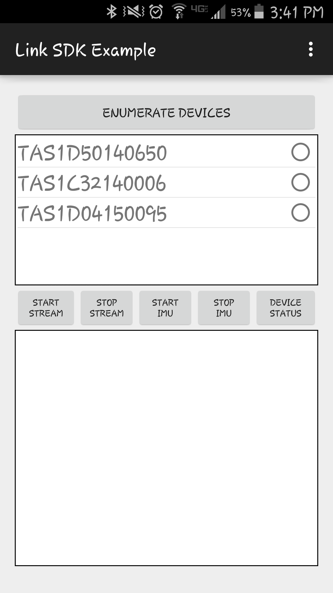
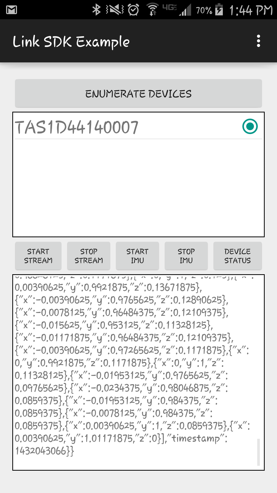

## ActiGraph Link SDK for Mobile Platforms ##

###### 2015-05-18
###### Version 1.0 Technical overview [limited release]

####  Contents  ####
- Introduction
- What can I do with this SDK?
- Integrating with the Mobile SDK
- Technical Overview
- Sample Application


#### Introduction ####
The Actigraph Software Development Kit (SDK) for mobile platforms allows the researcher community to build solutions for their use cases on top of the Actigraph core technologies.  
The SDK works with the ActiGraph Link activity monitors and leverages the BlueTooth LE wireless protocol.


#### What can I do with this SDK? ####

- Connect with Link activity monitors from a mobile device via BT LE wireless
- Enable streaming of raw accelerometer data (30 - 100 Hz)
- Configure (enable/disable) the monitor's embedded sensors
       * Accelerometer
       * Gyroscope
       * Magnetometer
       * Temperature

#### Integrating with the Mobile SDK ####


1. Obtain the SDK from GitHub:
	* Actigraph Link SDK for Android with Sample App [https://github.com/actigraph/ActigraphLinkSDK](https://github.com/actigraph/ActigraphLinkSDK "Actigraph Link SDK")
	* Actigraph Link SDK for IOS (Not available at this time)
2. Get our credentials for using the SDK with you Link monitors. Specifically, this will be an ActiGraph CentrePoint Account:
	* Contact sales@actigraphcorp.com
3. Consult example application and API documentation:
	* [AGDeviceLibrary](AGDeviceLibrary.md)
	* [AGDeviceLibraryListener](AGDeviceLibraryListener.md)
	* Also located at Documents/index.html when downloaded


#### Technical Overview ####

Add the Link SDK to your mobile project and utilize the device library and listener to communicate with ActiGraph Link monitors.  The device library has methods which facilitate establishing connections to Link devices and changing the device configuration.

* [AGDeviceLibrary](AGDeviceLibrary.md)
* [AGDeviceLibraryListener](AGDeviceLibraryListener.md)

The library uses JSON message formatting to further decouple the data layer dependencies from your particular use case.

###### IMU Configuration
```
{
    "imu": {
    	"accelerometer": "disable",
        "gyroscope": "enable",
        "magnetometer": "disable",
		"temperature": "disable"
    }
}
```

Stream raw monitor data to your app in near-realtime

###### Raw Data Stream
```
{
    "raw": {
    	“device”: “TAS1D44140005”,
    	"timestamp": 1427113646,
    	"acceleration": [
      		{
        		"x": 0.0003,
        		"y": 1.0002,
        		"z": 0.0001
      		},
      		{
        		"x": 0.0001,
        		"y": 0.0003,
        		"z": 1.0001
      		}
    	]
  }
}
```

#### Sample Application ####

Actigraph has developed an open-source sample application that helps developers get started with the SDK.  Some screen images are provided in this section.


######Sample App screen capture of device enumeration

######Sample App screen capture of device status

######Sample App screen capture of raw data streaming


#### Notes ####
* API documentation located at Documents/index.html
* Device library used by example app located at LinkSDKExampleApp/agdevicelibrary-release.aar
